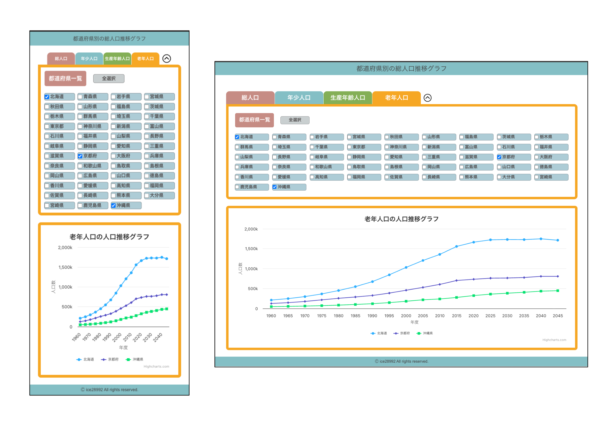

# フロントエンドコーディング試験

このリポジトリは、株式会社ゆめみ様のフロントエンドコーディング試験の提出物です。  
指定された要件に基づき実装を行いました。

##  概要
- Next.js をベースに、TypeScript + Tailwind CSS で開発
- グラフ描画には Highcharts を使用
- コンポーネントの再利用性や視認性も意識した設計
- Figma で事前に簡易設計を実施し、Atomic Design にも配慮

- Figmaリンク：[フロントエンドコーディング試験](https://www.figma.com/design/SOGqrrZQQgbricSlpvVEbK/%E3%83%95%E3%83%AD%E3%83%B3%E3%83%88%E3%82%A8%E3%83%B3%E3%83%89?node-id=0-1&p=f&t=j4tbmMnEgcyFPff9-0)

## デプロイ

- Vercelによって自動でデプロイを行なっています
- 本番環境URL: [frontend-coding-chi.vercel.app](frontend-coding-chi.vercel.app)

## 動作


## 技術スタック

|技術              |バージョン    |用途                       |
|-----------------|------------|---------------------------|
|React            |19.1.0      | UIライブラリ               |
|Next.js          |15.5.4      | フレームワーク              |
|TypeScript       |5.9.3       | 型定義                     |
|Tailwind CSS     |4.1.14      | CSS フレームワーク           |
|highcharts       |12.4.0      | グラフ描画ライブラリ          |
|React icons      |5.5.0       | アイコン                     |
|ESLint           |9.37.0      | 静的コード解析               |
|Prettier         |3.6.2       | コードフォーマッタ            |
|Testing Library  |16.3.0      | テストユーティリティ           |
|ts-jest          |29.4.5      | JestでTypeScriptテスト       |

---

## 実行までの環境セットアップ

1. リポジトリをクローンします

   ```bash
   git clone https://github.com/ice28992/frontend-coding.git
   cd frontend-coding
   ```

2. 依存関係をインストールします

   ```bash
   npm install
   ```

3. .env.localファイルを作成します

    ```bash
    NEXT_PUBLIC_API_KEY = "API KEY"
    ```

4. 開発サーバーを起動します

   ```bash
   npm run dev
   ```

5. ブラウザで `http://localhost:3000` を開いて動作を確認が可能です


## テスト実行用の環境セットアップ

1. jestとReact Testing Library依存関係のインストール

    ```bash
    npm install --save-dev jest ts-jest @types/jest typescript
    ```

2. テストの実行

    ```bash
    npm test
    ```

## テストコード
テストコードを書く際に簡単なテストケース一覧を作成することに生成AI ChatGPTを用いた。
また、ダミーデータとしてモック化しておく部分はGeminiを用いることで効率化した。

>  1. Base.test.tsx：ヘッダーとフッターのテスト
>  2. Chart.test.tsx：グラフ表示のテスト
>  3. PrefectureList.test.tsx：都道府県一覧データ取得テスト
>  4. SwitchTabs.test.tsx：タブ切り替えテスト

## テストケース

### SwitchTabs Component
- タブを選択した際に、`setSelectedTabs` が呼び出される
- 都道府県選択データが取得され、`checkPrefs` が呼び出される
- トグルボタンでカードが開閉できる
- カード開閉後、選択状態が維持され、`PrefectureList` にデータが渡される

### PrefectureList Component
- 都道府県データが正しく取得され、一覧表示されること
- 都道府県を選択・解除した際に、`selectChange` が呼び出される
- ボタン操作で、全ての都道府県を選択・解除できる

### Chart Component
- 都道府県が選択された場合、データが取得されグラフが表示される
- 都道府県が未選択の場合、選択を促すメッセージが表示され、グラフが非表示になる

### Base Component
- ヘッダーコンポーネントが正しくレンダリングされる
- フッターコンポーネントが正しくレンダリングされる

## 工夫した点・追加した機能

### プログラム面での工夫
- モバイルファースト設計・レスポンシブ対応
- APIキーを.env.localに書くことでセキュリティ面に配慮
- Atomic Design を意識したコンポーネント設計
- 型安全性を担保するため、props に明示的な型定義を徹底
- テスト時に pass 状況をコンソールに出力

### チーム開発想定の工夫
- コミットメッセージに Prefix をつけて作業内容をわかりやすく
- `main` と `develop` ブランチに分割し、安定した開発フローを確保

### 追加できた機能
- 都道府県の全選択/全解除ボタン
- チェックボックス表示部分のみ折りたたみ機能でグラフの視認性向上



## Prefixについて
コミットメッセージのPrefixは基本的に下記の通りとしています。
```
feat: 新しい機能
fix: バグの修正
docs: ドキュメントのみの変更
style: css関係
refactor: 仕様に影響がないコード改善(リファクタ)
chore: パッケージ更新など
test: テスト関連
change: 空白、フォーマット、セミコロン追加など
add: ファイル・フォルダの追加
```

## 反省・改善点

- テストしやすいコードを意識的に書きたかった
- コンポーネントのStorybook化
- スマホ表示で都道府県選択が多いとグラフ表示領域がかなり狭まってしまう
- 初めてテストまで行ったため理解するのに時間がかかってしまった


## 参考文献
### ESLint, Pritter
https://qiita.com/mysticatea/items/f523dab04a25f617c87d

https://zenn.dev/aew2sbee/articles/nextjs-prettier

https://zenn.dev/shimakaze_soft/articles/57642e22124968


### Hightcharts
https://zenn.dev/hitotori/articles/81792d51a4c767

### React icons
https://react-icons.github.io/react-icons/search/#q=arro

### Jest
https://qiita.com/okazuki/items/991a068892e946531612
